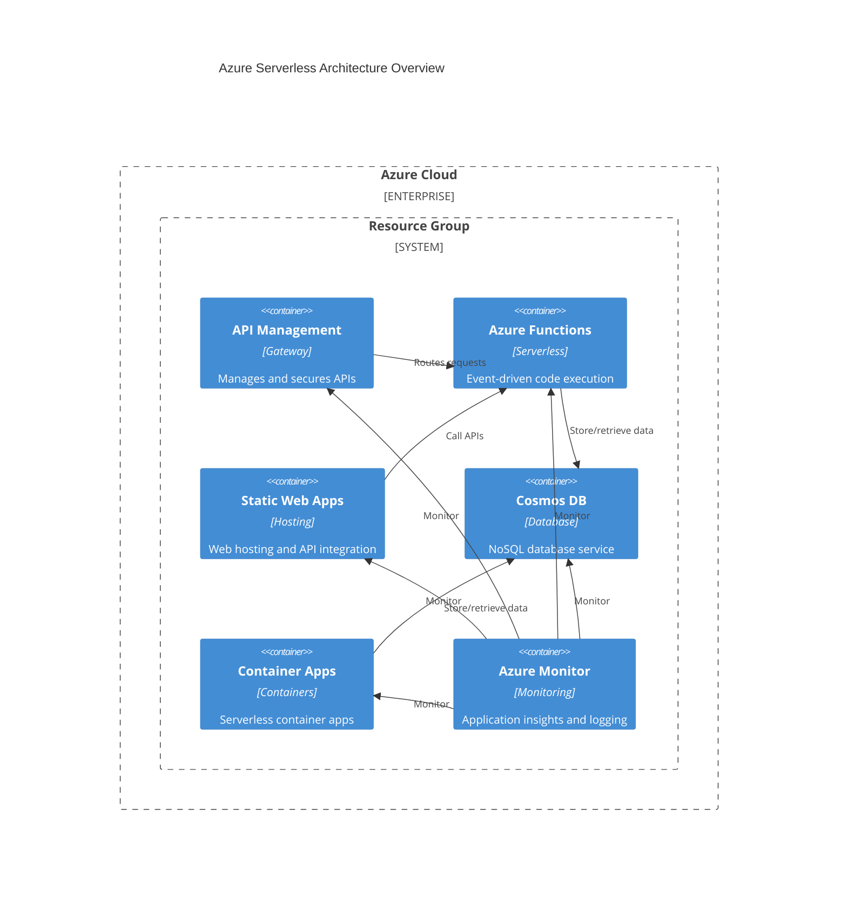

# Terraform modules for provisioning free serverless resource in Azure cloud

## Available Features

Currently below Azure services & resources are supported:
- Cosmos DB
- API Management
- Container Apps
- Functions
- Monitor
- Static Web Apps

## Prerequisites

1. Install tools:
   - [Terraform](https://developer.hashicorp.com/terraform/tutorials/azure-get-started/install-cli)
   - [Azure CLI](https://learn.microsoft.com/en-us/cli/azure/install-azure-cli)

## Examples

### Basic

#### Architecture



This diagram presents the high-level architecture of supported Azure services that can be deployed using these Terraform modules. All components are deployed within a single resource group and can be monitored using Azure Monitor.

#### Usage

1. Initialize Terraform:

```bash
cd examples/basic
terraform init
```

2. Prepare file with variables values:

```bash
cp example.tfvars terraform.tfvars
vi terraform.tfvars
```

3. Check costs before deploying:

```bash
infracost breakdown --path=.
```

4. Apply code for infrastructure:

```bash
terraform apply
```

## Links

* [Azure serverless](https://azure.microsoft.com/en-us/solutions/serverless)
* [Explore free Azure services](https://azure.microsoft.com/en-us/pricing/free-services)
